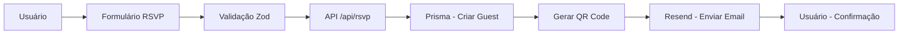

# Estrutura Detalhada de Arquivos

## 📁 Estrutura Completa do Projeto

```
/root/convite/
├── frontend/                          # Aplicação Next.js 14
│   ├── app/                          # App Router
│   │   ├── (auth)/                   # Grupo de rotas autenticadas
│   │   │   ├── login/
│   │   │   │   └── page.tsx
│   │   │   └── layout.tsx
│   │   ├── (public)/                 # Grupo de rotas públicas
│   │   │   ├── page.tsx              # Landing page principal
│   │   │   ├── nossa-historia/
│   │   │   │   └── page.tsx
│   │   │   ├── galeria/
│   │   │   │   └── page.tsx
│   │   │   ├── informacoes/
│   │   │   │   └── page.tsx
│   │   │   ├── rsvp/
│   │   │   │   ├── page.tsx
│   │   │   │   └── confirmacao/
│   │   │   │       └── [token]/
│   │   │   │           └── page.tsx
│   │   │   ├── presentes/
│   │   │   │   ├── page.tsx
│   │   │   │   └── [id]/
│   │   │   │       └── page.tsx
│   │   │   ├── checkout/
│   │   │   │   ├── page.tsx
│   │   │   │   ├── pix/
│   │   │   │   │   └── page.tsx
│   │   │   │   └── cartao/
│   │   │   │       └── page.tsx
│   │   │   └── contato/
│   │   │       └── page.tsx
│   │   ├── admin/                    # Área administrativa
│   │   │   ├── layout.tsx
│   │   │   ├── page.tsx             # Dashboard
│   │   │   ├── convidados/
│   │   │   │   ├── page.tsx
│   │   │   │   └── [id]/
│   │   │   │       └── page.tsx
│   │   │   ├── presentes/
│   │   │   │   ├── page.tsx
│   │   │   │   ├── novo/
│   │   │   │   │   └── page.tsx
│   │   │   │   └── [id]/
│   │   │   │       ├── page.tsx
│   │   │   │       └── editar/
│   │   │   │           └── page.tsx
│   │   │   ├── financeiro/
│   │   │   │   ├── page.tsx
│   │   │   │   ├── transacoes/
│   │   │   │   │   └── page.tsx
│   │   │   │   └── estornos/
│   │   │   │       └── page.tsx
│   │   │   ├── configuracoes/
│   │   │   │   ├── page.tsx
│   │   │   │   ├── evento/
│   │   │   │   │   └── page.tsx
│   │   │   │   ├── pix/
│   │   │   │   │   └── page.tsx
│   │   │   │   └── notificacoes/
│   │   │   │       └── page.tsx
│   │   │   └── logs/
│   │   │       └── page.tsx
│   │   ├── api/                     # API Routes (Next.js)
│   │   │   ├── auth/
│   │   │   │   └── [...nextauth]/
│   │   │   │       └── route.ts
│   │   │   ├── rsvp/
│   │   │   │   ├── route.ts
│   │   │   │   └── [id]/
│   │   │   │       └── route.ts
│   │   │   ├── gifts/
│   │   │   │   ├── route.ts
│   │   │   │   └── [id]/
│   │   │   │       └── route.ts
│   │   │   ├── payments/
│   │   │   │   ├── pix/
│   │   │   │   │   └── route.ts
│   │   │   │   ├── card/
│   │   │   │   │   └── route.ts
│   │   │   │   ├── installments/
│   │   │   │   │   └── route.ts
│   │   │   │   └── status/
│   │   │   │       └── [id]/
│   │   │   │           └── route.ts
│   │   │   ├── webhooks/
│   │   │   │   └── mercadopago/
│   │   │   │       └── route.ts
│   │   │   ├── admin/
│   │   │   │   ├── guests/
│   │   │   │   │   └── route.ts
│   │   │   │   ├── gifts/
│   │   │   │   │   └── route.ts
│   │   │   │   ├── contributions/
│   │   │   │   │   └── route.ts
│   │   │   │   └── stats/
│   │   │   │       └── route.ts
│   │   │   ├── upload/
│   │   │   │   └── route.ts
│   │   │   └── contact/
│   │   │       └── route.ts
│   │   ├── layout.tsx               # Layout raiz
│   │   ├── globals.css              # Estilos globais
│   │   ├── error.tsx                # Página de erro
│   │   ├── not-found.tsx            # Página 404
│   │   └── loading.tsx             # Loading global
│   │
│   ├── components/                  # Componentes reutilizáveis
│   │   ├── ui/                      # Componentes UI base
│   │   │   ├── button.tsx
│   │   │   ├── input.tsx
│   │   │   ├── select.tsx
│   │   │   ├── textarea.tsx
│   │   │   ├── card.tsx
│   │   │   ├── modal.tsx
│   │   │   ├── dialog.tsx
│   │   │   ├── tabs.tsx
│   │   │   ├── badge.tsx
│   │   │   ├── progress.tsx
│   │   │   ├── skeleton.tsx
│   │   │   └── toast.tsx
│   │   ├── layout/                  # Componentes de layout
│   │   │   ├── header.tsx
│   │   │   ├── footer.tsx
│   │   │   ├── navigation.tsx
│   │   │   └── mobile-menu.tsx
│   │   ├── sections/                # Seções da landing page
│   │   │   ├── hero.tsx
│   │   │   ├── countdown.tsx
│   │   │   ├── timeline.tsx
│   │   │   ├── gallery.tsx
│   │   │   ├── location.tsx
│   │   │   ├── weather.tsx
│   │   │   └── music-player.tsx
│   │   ├── forms/                   # Componentes de formulário
│   │   │   ├── rsvp-form.tsx
│   │   │   ├── contact-form.tsx
│   │   │   ├── payment-form.tsx
│   │   │   ├── card-form.tsx
│   │   │   └── gift-form.tsx
│   │   ├── gifts/                   # Componentes de presentes
│   │   │   ├── gift-card.tsx
│   │   │   ├── gift-grid.tsx
│   │   │   ├── gift-progress.tsx
│   │   │   ├── cart.tsx
│   │   │   └── checkout-tabs.tsx
│   │   ├── payments/                # Componentes de pagamento
│   │   │   ├── pix-qr-code.tsx
│   │   │   ├── pix-countdown.tsx
│   │   │   ├── card-inputs.tsx
│   │   │   ├── installments-select.tsx
│   │   │   └── payment-status.tsx
│   │   ├── admin/                   # Componentes admin
│   │   │   ├── dashboard-stats.tsx
│   │   │   ├── payment-chart.tsx
│   │   │   ├── guests-table.tsx
│   │   │   ├── gifts-table.tsx
│   │   │   ├── transactions-table.tsx
│   │   │   ├── qr-scanner.tsx
│   │   │   └── activity-log.tsx
│   │   └── common/                  # Componentes comuns
│   │       ├── loading-spinner.tsx
│   │       ├── error-message.tsx
│   │       ├── success-message.tsx
│   │       ├── confirm-dialog.tsx
│   │       └── image-optimizer.tsx
│   │
│   ├── lib/                         # Utilitários e helpers
│   │   ├── prisma.ts                # Cliente Prisma
│   │   ├── auth.ts                  # Configuração NextAuth
│   │   ├── validations.ts           # Schemas Zod
│   │   ├── cpf.ts                   # Validação CPF
│   │   ├── encryption.ts            # Criptografia AES-256
│   │   ├── rate-limit.ts            # Rate limiting
│   │   ├── mercadopago.ts           # Integração Mercado Pago
│   │   ├── resend.ts                # Integração Resend
│   │   ├── cloudinary.ts            # Integração Cloudinary
│   │   ├── qrcode.ts                # Geração QR Code
│   │   ├── date-utils.ts            # Utilitários de data
│   │   ├── format-utils.ts          # Formatação (moeda, telefone)
│   │   └── api-client.ts            # Cliente HTTP
│   │
│   ├── hooks/                       # Custom React Hooks
│   │   ├── use-countdown.ts
│   │   ├── use-local-storage.ts
│   │   ├── use-cart.ts
│   │   ├── use-payment.ts
│   │   ├── use-gifts.ts
│   │   ├── use-guests.ts
│   │   └── use-debounce.ts
│   │
│   ├── types/                       # Definições TypeScript
│   │   ├── index.ts                 # Tipos exportados
│   │   ├── event.ts
│   │   ├── guest.ts
│   │   ├── gift.ts
│   │   ├── contribution.ts
│   │   ├── payment.ts
│   │   └── api.ts
│   │
│   ├── styles/                      # Estilos adicionais
│   │   ├── animations.css           # Animações customizadas
│   │   ├── particles.css            # Partículas/pétalas
│   │   └── lightbox.css            # Lightbox galeria
│   │
│   ├── public/                      # Arquivos estáticos
│   │   ├── images/
│   │   │   ├── couple/
│   │   │   ├── gallery/
│   │   │   ├── gifts/
│   │   │   └── icons/
│   │   ├── fonts/
│   │   └── favicon.ico
│   │
│   ├── emails/                      # Templates de email
│   │   ├── rsvp-confirmation.html
│   │   ├── payment-confirmation.html
│   │   ├── payment-pending.html
│   │   └── admin-notification.html
│   │
│   ├── middleware.ts                # Middleware Next.js
│   ├── next.config.js               # Configuração Next.js
│   ├── tailwind.config.ts           # Configuração Tailwind
│   ├── postcss.config.js            # Configuração PostCSS
│   ├── tsconfig.json                # Configuração TypeScript
│   ├── package.json
│   └── .env.local                  # Variáveis de ambiente (local)
│
├── backend/                         # API Express (opcional, se necessário)
│   ├── src/
│   │   ├── index.ts                 # Entry point
│   │   ├── app.ts                  # Configuração Express
│   │   ├── routes/                 # Rotas Express
│   │   │   ├── index.ts
│   │   │   ├── rsvp.ts
│   │   │   ├── gifts.ts
│   │   │   ├── payments.ts
│   │   │   └── webhooks.ts
│   │   ├── controllers/             # Controladores
│   │   │   ├── rsvp.controller.ts
│   │   │   ├── gifts.controller.ts
│   │   │   ├── payments.controller.ts
│   │   │   └── admin.controller.ts
│   │   ├── services/               # Serviços de negócio
│   │   │   ├── rsvp.service.ts
│   │   │   ├── gifts.service.ts
│   │   │   ├── payments.service.ts
│   │   │   ├── email.service.ts
│   │   │   └── mercadopago.service.ts
│   │   ├── middleware/             # Middleware Express
│   │   │   ├── auth.middleware.ts
│   │   │   ├── error.middleware.ts
│   │   │   ├── rate-limit.middleware.ts
│   │   │   └── validation.middleware.ts
│   │   ├── utils/                  # Utilitários
│   │   │   ├── logger.ts
│   │   │   ├── encryption.ts
│   │   │   └── validators.ts
│   │   └── config/                 # Configurações
│   │       ├── database.ts
│   │       ├── mercadopago.ts
│   │       └── email.ts
│   ├── tests/                      # Testes
│   │   ├── unit/
│   │   ├── integration/
│   │   └── e2e/
│   ├── package.json
│   ├── tsconfig.json
│   └── .env                        # Variáveis de ambiente
│
├── database/                        # Configurações do banco
│   ├── config/
│   │   ├── schema.prisma           # Schema Prisma
│   │   └── .env.example            # Exemplo de variáveis
│   ├── migrations/                  # Migrations Prisma
│   │   └── 20250129_init/
│   │       └── migration.sql
│   ├── seeds/                      # Seeds para dados de teste
│   │   ├── seed.ts
│   │   └── data/
│   │       ├── gifts.json
│   │       └── event.json
│   └── scripts/                    # Scripts utilitários
│       ├── migrate.ts
│       ├── seed.ts
│       └── anonymize.ts             # Anonimização LGPD
│
├── docs/                           # Documentação
│   ├── api/
│   │   ├── README.md
│   │   ├── endpoints.md
│   │   ├── authentication.md
│   │   └── webhooks.md
│   ├── design/
│   │   ├── README.md
│   │   ├── colors.md
│   │   ├── typography.md
│   │   ├── components.md
│   │   └── animations.md
│   ├── requirements/
│   │   ├── README.md
│   │   ├── functional.md
│   │   ├── non-functional.md
│   │   └── security.md
│   ├── deployment/
│   │   ├── README.md
│   │   ├── vercel.md
│   │   ├── database.md
│   │   └── monitoring.md
│   └── user-guides/
│       ├── admin-panel.md
│       ├── changing-content.md
│       ├── payment-fees.md
│       └── event-checklist.md
│
├── assets/                         # Arquivos estáticos
│   ├── images/
│   │   ├── couple/
│   │   ├── gallery/
│   │   ├── gifts/
│   │   └── icons/
│   ├── fonts/
│   │   ├── PlayfairDisplay/
│   │   └── Inter/
│   └── icons/
│
├── scripts/                        # Scripts de automação
│   ├── setup.sh                    # Script de setup inicial
│   ├── deploy.sh                   # Script de deploy
│   ├── backup.sh                   # Script de backup
│   └── test.sh                     # Script de testes
│
├── config/                         # Configurações do projeto
│   ├── eslint.config.js
│   ├── prettier.config.js
│   └── commitlint.config.js
│
├── plans/                          # Planos e documentação
│   ├── plano-detalhado.md
│   └── estrutura-arquivos.md
│
├── .gitignore
├── .env.example                   # Exemplo de variáveis de ambiente
├── README.md                       # Documentação principal
├── docker-compose.yml              # Docker Compose (opcional)
└── package.json                   # Root package.json (workspaces)
```

---

## 📄 Arquivos Chave Explicados

### Frontend - App Router

#### [`app/layout.tsx`](../frontend/app/layout.tsx)
Layout raiz da aplicação. Define:
- Fontes (Playfair Display, Inter)
- Metadados SEO
- Tema e cores
- Providers globais (SessionProvider, etc.)

#### [`app/page.tsx`](../frontend/app/page.tsx)
Landing page principal com:
- Hero section com contador regressivo
- Navegação para seções
- Call-to-action para RSVP

#### [`app/(public)/rsvp/page.tsx`](../frontend/app/(public)/rsvp/page.tsx)
Formulário RSVP com:
- Campos: nome, email, telefone, acompanhantes
- Preferências alimentares
- Sugestão de música
- Validação com Zod
- Geração de QR Code

#### [`app/(public)/presentes/page.tsx`](../frontend/app/(public)/presentes/page.tsx)
Lista de presentes com:
- Grid responsivo
- Sistema de cotas
- Carrinho de compras
- Progresso de arrecadação

#### [`app/(public)/checkout/page.tsx`](../frontend/app/(public)/checkout/page.tsx)
Checkout com:
- Abas: PIX, Cartão, Boleto
- Integração Mercado Pago
- Validação CPF
- Parcelamento dinâmico

#### [`app/admin/page.tsx`](../frontend/app/admin/page.tsx)
Dashboard administrativo com:
- Estatísticas gerais
- Gráficos de pagamentos
- Lista de presentes populares
- Taxa de conversão

### Componentes

#### [`components/ui/`](../frontend/components/ui/)
Componentes UI base reutilizáveis:
- Button, Input, Select, etc.
- Modal, Dialog, Tabs
- Badge, Progress, Skeleton
- Toast notifications

#### [`components/sections/`](../frontend/components/sections/)
Seções da landing page:
- Hero com parallax
- Countdown timer
- Timeline animada
- Galeria com lightbox
- Localização (Google Maps)
- Previsão do tempo
- Player de música

#### [`components/payments/`](../frontend/components/payments/)
Componentes de pagamento:
- QR Code PIX
- Countdown de expiração
- Inputs de cartão
- Seletor de parcelas
- Status de pagamento

### Lib - Utilitários

#### [`lib/prisma.ts`](../frontend/lib/prisma.ts)
Cliente Prisma singleton:
```typescript
import { PrismaClient } from '@prisma/client'

const globalForPrisma = globalThis as unknown as {
  prisma: PrismaClient | undefined
}

export const prisma = globalForPrisma.prisma ?? new PrismaClient()

if (process.env.NODE_ENV !== 'production') globalForPrisma.prisma = prisma
```

#### [`lib/validations.ts`](../frontend/lib/validations.ts)
Schemas Zod para validação:
- RSVP schema
- Payment schema
- Gift schema
- CPF validation

#### [`lib/cpf.ts`](../frontend/lib/cpf.ts)
Validação de CPF (algoritmo módulo 11):
```typescript
export function validateCPF(cpf: string): boolean {
  // Implementação do algoritmo módulo 11
}
```

#### [`lib/encryption.ts`](../frontend/lib/encryption.ts)
Criptografia AES-256 para dados sensíveis:
```typescript
export function encrypt(text: string): string
export function decrypt(encryptedText: string): string
```

#### [`lib/mercadopago.ts`](../frontend/lib/mercadopago.ts)
Integração com Mercado Pago:
- Criar pagamento PIX
- Criar pagamento cartão
- Calcular parcelas
- Verificar status

#### [`lib/resend.ts`](../frontend/lib/resend.ts)
Integração com Resend para emails:
- Enviar confirmação RSVP
- Enviar confirmação pagamento
- Enviar notificações admin

### API Routes

#### [`app/api/payments/pix/route.ts`](../frontend/app/api/payments/pix/route.ts)
Endpoint para criar pagamento PIX:
```typescript
export async function POST(request: Request) {
  // 1. Validar dados
  // 2. Validar CPF
  // 3. Criar pagamento Mercado Pago
  // 4. Salvar no banco
  // 5. Retornar QR Code
}
```

#### [`app/api/webhooks/mercadopago/route.ts`](../frontend/app/api/webhooks/mercadopago/route.ts)
Webhook do Mercado Pago:
```typescript
export async function POST(request: Request) {
  // 1. Validar assinatura
  // 2. Processar payload
  // 3. Atualizar status pagamento
  // 4. Enviar email confirmação
  // 5. Notificar admin
}
```

### Database

#### [`database/config/schema.prisma`](../database/config/schema.prisma)
Schema completo do banco:
- Event
- Guest
- Gift
- Contribution

#### [`database/scripts/anonymize.ts`](../database/scripts/anonymize.ts)
Script de anonimização LGPD:
```typescript
// Remove dados pessoais 90 dias após evento
// Mantém apenas dados estatísticos
```

---

## 🔄 Fluxo de Dados

### RSVP Flow



### Payment Flow

```mermaid
graph LR
    A[Usuário] --> B[Checkout]
    B --> C[Validação CPF]
    C --> D[API /api/payments]
    D --> E[Mercado Pago]
    E --> F[Prisma - Criar Contribution]
    F --> G[Retornar QR Code/Token]
    G --> H[Usuário - Pagamento]
    H --> I[Webhook Mercado Pago]
    I --> J[API /api/webhooks]
    J --> K[Prisma - Atualizar Status]
    K --> L[Resend - Email Confirmação]
```



---

## 📝 Convenções de Código

### TypeScript
- Usar tipos estritos (`strict: true`)
- Interfaces para contratos
- Types para tipos primitivos
- Generics quando apropriado

### React
- Functional components
- Hooks para estado e efeitos
- Props com TypeScript
- Component files: `PascalCase.tsx`

### CSS/Tailwind
- Mobile-first approach
- Utility classes do Tailwind
- Custom CSS apenas quando necessário
- Variáveis CSS para cores

### API
- RESTful conventions
- HTTP methods apropriados
- Status codes corretos
- Error handling consistente

---

**Última Atualização:** 29/01/2025
**Versão:** 1.0.0
