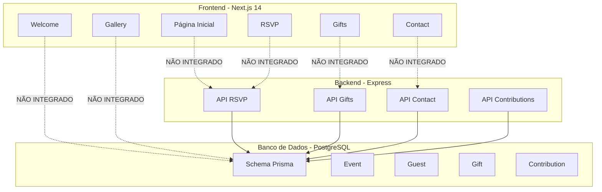
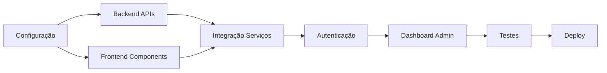

# Plano de Integração do Sistema de Convite de Casamento

## 📋 Visão Geral

Este plano detalha a integração completa de todas as opções existentes no projeto, garantindo que o frontend, backend e banco de dados funcionem de forma coesa e modular.

## 🏗️ Arquitetura Atual

### Estado Atual do Sistema



## 🎯 Objetivos de Integração

### 1. Conexão Frontend-Backend
- Implementar cliente HTTP para chamadas de API
- Criar tipos TypeScript compartilhados
- Implementar tratamento de erros
- Adicionar loading states

### 2. Integração de Serviços Externos
- Mercado Pago (pagamentos PIX e cartão)
- Resend (envio de emails)
- Cloudinary (upload de imagens)
- Google Maps (localização)
- OpenWeather (previsão do tempo)

### 3. Autenticação e Autorização
- NextAuth.js para autenticação
- Middleware de proteção de rotas
- Dashboard administrativo

### 4. Melhorias de UX
- React Hook Form para formulários
- Zod para validação
- Framer Motion para animações
- Componentes reutilizáveis

## 📊 Inventário de Opções Existentes

### Backend (API Routes)

| Rota | Método | Status | Descrição |
|------|--------|--------|-----------|
| `/api/rsvp` | GET | ✅ Implementado | Listar todos os convidados |
| `/api/rsvp` | POST | ✅ Implementado | Criar novo convidado |
| `/api/rsvp/:id` | GET | ✅ Implementado | Buscar convidado específico |
| `/api/rsvp/:id` | PUT | ✅ Implementado | Atualizar convidado |
| `/api/rsvp/:id` | DELETE | ✅ Implementado | Deletar convidado |
| `/api/rsvp/qr/:token` | GET | ✅ Implementado | Validar QR Code |
| `/api/gifts` | GET | ✅ Implementado | Listar presentes |
| `/api/gifts` | POST | ✅ Implementado | Criar presente |
| `/api/gifts/:id` | GET | ✅ Implementado | Buscar presente |
| `/api/gifts/:id` | PUT | ✅ Implementado | Atualizar presente |
| `/api/gifts/:id` | DELETE | ✅ Implementado | Deletar presente |
| `/api/gifts/:id/reserve` | POST | ✅ Implementado | Reservar presente (legado) |
| `/api/contact` | GET | ⚠️ Parcial | Listar mensagens (stub) |
| `/api/contact` | POST | ⚠️ Parcial | Enviar mensagem (stub) |
| `/api/contributions` | GET | ✅ Implementado | Listar contribuições |
| `/api/contributions` | POST | ✅ Implementado | Criar contribuição |
| `/api/contributions/:id` | GET | ✅ Implementado | Buscar contribuição |
| `/api/contributions/webhook` | POST | ✅ Implementado | Webhook pagamento |

### Frontend (Páginas)

| Página | Status | Integração Backend | Funcionalidades |
|--------|--------|-------------------|-----------------|
| `/` (Home) | ✅ Implementado | ❌ Não integrado | Navegação básica |
| `/welcome` | ✅ Implementado | ❌ Não integrado | Informações estáticas |
| `/rsvp` | ✅ Implementado | ❌ Não integrado | Formulário sem envio |
| `/gifts` | ✅ Implementado | ❌ Não integrado | Dados mockados |
| `/gallery` | ✅ Implementado | ❌ Não integrado | Galeria estática |
| `/contact` | ✅ Implementado | ❌ Não integrado | Formulário sem envio |

### Banco de Dados (Schema Prisma)

| Modelo | Campos | Relações | Status |
|--------|--------|----------|--------|
| Event | 10 campos | gifts, guests | ✅ Definido |
| Guest | 12 campos | event, contributions | ✅ Definido |
| Gift | 8 campos | event, contributions | ✅ Definido |
| Contribution | 14 campos | gift, guest | ✅ Definido |
| RSVP | 8 campos | - | ⚠️ Legado |
| Contact | 6 campos | - | ⚠️ Legado |

## 🔧 Plano de Integração por Módulo

### Fase 1: Fundação (Infraestrutura)

#### 1.1 Configuração de Bibliotecas Frontend

```bash
cd frontend
npm install react-hook-form zod @hookform/resolvers framer-motion qrcode.react
npm install @radix-ui/react-dialog @radix-ui/react-dropdown-menu @radix-ui/react-select
npm install lucide-react date-fns clsx tailwind-merge
npm install -D @types/node
```

#### 1.2 Configuração de Bibliotecas Backend

```bash
cd backend
npm install mercadopago resend cloudinary next-auth bcryptjs jsonwebtoken
npm install @prisma/client
npm install -D @types/bcryptjs @types/jsonwebtoken
```

#### 1.3 Tipos TypeScript Compartilhados

Criar arquivo `frontend/types/index.ts`:

```typescript
// Tipos de Evento
export interface Event {
  id: string
  coupleNames: string
  date: string
  venue: string
  venueMapsUrl?: string
  description?: string
  pixKey?: string
  pixKeyType?: string
  createdAt: string
  updatedAt: string
}

// Tipos de Convidado
export interface Guest {
  id: string
  eventId: string
  name: string
  email: string
  phone?: string
  confirmed: boolean
  guestCount: number
  dietaryRestrictions?: string
  suggestedSong?: string
  qrCodeToken: string
  createdAt: string
  updatedAt: string
  event?: Event
  contributions?: Contribution[]
}

// Tipos de Presente
export interface Gift {
  id: string
  eventId: string
  title: string
  description?: string
  imageUrl?: string
  totalValue: string
  status: 'available' | 'fulfilled' | 'hidden'
  totalReceived?: number
  progress?: number
  remaining?: number
  createdAt: string
  updatedAt: string
  event?: Event
  contributions?: Contribution[]
}

// Tipos de Contribuição
export interface Contribution {
  id: string
  giftId: string
  guestId?: string
  amount: string
  message?: string
  isAnonymous: boolean
  payerName: string
  payerEmail: string
  payerCPF: string
  payerPhone?: string
  paymentMethod: 'pix' | 'credit_card' | 'boleto'
  paymentStatus: 'pending' | 'approved' | 'cancelled' | 'refunded'
  gatewayId: string
  gatewayResponse?: any
  installments: number
  installmentAmount?: string
  createdAt: string
  updatedAt: string
  gift?: Gift
  guest?: Guest
}

// Tipos de API Response
export interface ApiResponse<T> {
  data?: T
  error?: string
  message?: string
}
```

### Fase 2: Integração Frontend-Backend

#### 2.1 Cliente HTTP

Criar `frontend/lib/api.ts`:

```typescript
const API_BASE_URL = process.env.NEXT_PUBLIC_API_URL || 'http://localhost:3001/api'

export async function apiRequest<T>(
  endpoint: string,
  options: RequestInit = {}
): Promise<ApiResponse<T>> {
  try {
    const response = await fetch(`${API_BASE_URL}${endpoint}`, {
      headers: {
        'Content-Type': 'application/json',
        ...options.headers,
      },
      ...options,
    })

    const data = await response.json()

    if (!response.ok) {
      return { error: data.error || 'Erro na requisição' }
    }

    return { data }
  } catch (error) {
    return { error: 'Erro de conexão com o servidor' }
  }
}

// RSVP API
export const rsvpApi = {
  getAll: () => apiRequest<Guest[]>('/rsvp'),
  create: (data: Partial<Guest>) =>
    apiRequest<Guest>('/rsvp', {
      method: 'POST',
      body: JSON.stringify(data),
    }),
  getById: (id: string) => apiRequest<Guest>(`/rsvp/${id}`),
  update: (id: string, data: Partial<Guest>) =>
    apiRequest<Guest>(`/rsvp/${id}`, {
      method: 'PUT',
      body: JSON.stringify(data),
    }),
  delete: (id: string) =>
    apiRequest<{ message: string }>(`/rsvp/${id}`, {
      method: 'DELETE',
    }),
  validateQR: (token: string) => apiRequest<{ valid: boolean; guest: Guest }>(`/rsvp/qr/${token}`),
}

// Gifts API
export const giftsApi = {
  getAll: (eventId?: string) =>
    apiRequest<Gift[]>(`/gifts${eventId ? `?eventId=${eventId}` : ''}`),
  create: (data: Partial<Gift>) =>
    apiRequest<Gift>('/gifts', {
      method: 'POST',
      body: JSON.stringify(data),
    }),
  getById: (id: string) => apiRequest<Gift>(`/gifts/${id}`),
  update: (id: string, data: Partial<Gift>) =>
    apiRequest<Gift>(`/gifts/${id}`, {
      method: 'PUT',
      body: JSON.stringify(data),
    }),
  delete: (id: string) =>
    apiRequest<{ message: string }>(`/gifts/${id}`, {
      method: 'DELETE',
    }),
  reserve: (id: string, data: { name: string; email: string }) =>
    apiRequest<{ message: string; reservation: any }>(`/gifts/${id}/reserve`, {
      method: 'POST',
      body: JSON.stringify(data),
    }),
}

// Contributions API
export const contributionsApi = {
  getAll: (params?: { giftId?: string; guestId?: string; status?: string }) => {
    const searchParams = new URLSearchParams()
    if (params?.giftId) searchParams.append('giftId', params.giftId)
    if (params?.guestId) searchParams.append('guestId', params.guestId)
    if (params?.status) searchParams.append('status', params.status)
    return apiRequest<Contribution[]>(`/contributions?${searchParams.toString()}`)
  },
  create: (data: Partial<Contribution>) =>
    apiRequest<Contribution>('/contributions', {
      method: 'POST',
      body: JSON.stringify(data),
    }),
  getById: (id: string) => apiRequest<Contribution>(`/contributions/${id}`),
}

// Contact API
export const contactApi = {
  send: (data: { name: string; email: string; subject: string; message: string }) =>
    apiRequest<{ message: string; contact: any }>('/contact', {
      method: 'POST',
      body: JSON.stringify(data),
    }),
}
```

#### 2.2 Integração RSVP

Atualizar `frontend/app/rsvp/page.tsx` para usar a API:

```typescript
'use client'

import { useState } from 'react'
import { useForm } from 'react-hook-form'
import { zodResolver } from '@hookform/resolvers/zod'
import * as z from 'zod'
import { rsvpApi } from '@/lib/api'

const rsvpSchema = z.object({
  name: z.string().min(3, 'Nome deve ter pelo menos 3 caracteres'),
  email: z.string().email('Email inválido'),
  phone: z.string().min(10, 'Telefone deve ter pelo menos 10 dígitos'),
  guestCount: z.number().min(1, 'Pelo menos 1 convidado').max(10, 'Máximo 10 convidados'),
  dietaryRestrictions: z.string().optional(),
  suggestedSong: z.string().optional(),
})

type RSVPFormData = z.infer<typeof rsvpSchema>

export default function RSVP() {
  const [loading, setLoading] = useState(false)
  const [success, setSuccess] = useState(false)
  const [error, setError] = useState('')

  const {
    register,
    handleSubmit,
    formState: { errors },
  } = useForm<RSVPFormData>({
    resolver: zodResolver(rsvpSchema),
  })

  const onSubmit = async (data: RSVPFormData) => {
    setLoading(true)
    setError('')

    const result = await rsvpApi.create(data)

    if (result.error) {
      setError(result.error)
    } else {
      setSuccess(true)
    }

    setLoading(false)
  }

  if (success) {
    return (
      <main className="min-h-screen flex flex-col items-center justify-center p-8">
        <div className="max-w-2xl w-full text-center">
          <div className="bg-white rounded-lg shadow-lg p-8">
            <div className="text-6xl mb-4">✅</div>
            <h1 className="text-4xl font-bold mb-4 text-primary-600">
              Confirmação Realizada!
            </h1>
            <p className="text-xl text-gray-700 mb-8">
              Obrigado por confirmar sua presença. Estamos ansiosos para te ver no nosso casamento!
            </p>
            <a
              href="/"
              className="inline-block bg-primary-500 hover:bg-primary-600 text-white font-bold py-3 px-6 rounded-lg transition-colors"
            >
              Voltar ao Início
            </a>
          </div>
        </div>
      </main>
    )
  }

  return (
    <main className="min-h-screen flex flex-col items-center justify-center p-8">
      <div className="max-w-2xl w-full">
        <h1 className="text-5xl font-bold mb-6 text-primary-600 text-center">
          Confirmar Presença
        </h1>
        <div className="bg-white rounded-lg shadow-lg p-8">
          {error && (
            <div className="mb-6 p-4 bg-red-100 border border-red-400 text-red-700 rounded">
              {error}
            </div>
          )}
          <form onSubmit={handleSubmit(onSubmit)} className="space-y-6">
            {/* Form fields with validation */}
          </form>
        </div>
      </div>
    </main>
  )
}
```

### Fase 3: Componentes Reutilizáveis

#### 3.1 Estrutura de Componentes

```
frontend/components/
├── ui/
│   ├── button.tsx
│   ├── input.tsx
│   ├── textarea.tsx
│   ├── card.tsx
│   ├── dialog.tsx
│   └── select.tsx
├── layout/
│   ├── navbar.tsx
│   ├── footer.tsx
│   └── container.tsx
├── forms/
│   ├── rsvp-form.tsx
│   ├── contact-form.tsx
│   └── contribution-form.tsx
├── gift/
│   ├── gift-card.tsx
│   ├── gift-grid.tsx
│   └── contribution-progress.tsx
└── shared/
    ├── countdown.tsx
    ├── qr-code.tsx
    └── loading-spinner.tsx
```

### Fase 4: Integração de Serviços Externos

#### 4.1 Mercado Pago

Criar `backend/src/services/mercadopago.ts`:

```typescript
import mercadopago from 'mercadopago'

mercadopago.configure({
  access_token: process.env.MP_ACCESS_TOKEN,
})

export interface PaymentData {
  title: string
  amount: number
  description?: string
  payer: {
    email: string
    name: string
    identification: {
      type: 'CPF'
      number: string
    }
  }
  paymentMethodId?: string
  installments?: number
}

export async function createPixPayment(data: PaymentData) {
  const payment = await mercadopago.payment.create({
    transaction_amount: data.amount,
    description: data.description,
    payment_method_id: 'pix',
    payer: {
      email: data.payer.email,
      first_name: data.payer.name.split(' ')[0],
      last_name: data.payer.name.split(' ').slice(1).join(' '),
      identification: data.payer.identification,
    },
  })

  return {
    id: payment.body.id,
    qrCode: payment.body.point_of_interaction.transaction_data.qr_code,
    qrCodeBase64: payment.body.point_of_interaction.transaction_data.qr_code_base64,
    ticketUrl: payment.body.point_of_interaction.ticket_url,
    expiresAt: new Date(Date.now() + 30 * 60 * 1000),
  }
}

export async function createCardPayment(data: PaymentData) {
  const payment = await mercadopago.payment.create({
    transaction_amount: data.amount,
    token: data.paymentMethodId,
    description: data.description,
    installments: data.installments || 1,
    payment_method_id: data.paymentMethodId,
    payer: {
      email: data.payer.email,
      identification: data.payer.identification,
    },
  })

  return payment.body
}

export function verifyWebhookSignature(signature: string, payload: string): boolean {
  const secret = process.env.MP_WEBHOOK_SECRET
  const hmac = crypto.createHmac('sha256', secret)
  const digest = hmac.update(payload).digest('hex')
  return signature === `sha256=${digest}`
}
```

#### 4.2 Resend (Email)

Criar `backend/src/services/email.ts`:

```typescript
import { Resend } from 'resend'

const resend = new Resend(process.env.RESEND_API_KEY)

export async function sendRSVPConfirmation(
  email: string,
  guestName: string,
  qrCodeToken: string
) {
  await resend.emails.send({
    from: process.env.RESEND_FROM_EMAIL || 'noreply@convitecasamento.com',
    to: email,
    subject: 'Confirmação de Presença - Casamento',
    html: `
      <h1>Olá, ${guestName}!</h1>
      <p>Sua presença foi confirmada com sucesso.</p>
      <p>Aqui está seu QR Code para entrada no evento:</p>
      
    `,
  })
}

export async function sendPaymentConfirmation(
  email: string,
  guestName: string,
  giftTitle: string,
  amount: number
) {
  await resend.emails.send({
    from: process.env.RESEND_FROM_EMAIL || 'noreply@convitecasamento.com',
    to: email,
    subject: 'Pagamento Confirmado - Lista de Presentes',
    html: `
      <h1>Obrigado, ${guestName}!</h1>
      <p>Seu pagamento de R$ ${amount.toFixed(2)} para o presente "${giftTitle}" foi confirmado.</p>
      <p>Agradecemos muito pelo carinho!</p>
    `,
  })
}
```

### Fase 5: Dashboard Administrativo

#### 5.1 Estrutura do Admin

```
frontend/app/admin/
├── layout.tsx
├── page.tsx (Dashboard)
├── guests/
│   └── page.tsx
├── gifts/
│   └── page.tsx
├── contributions/
│   └── page.tsx
└── settings/
    └── page.tsx
```

### Fase 6: Autenticação

#### 6.1 NextAuth Configuration

Criar `backend/src/auth.ts`:

```typescript
import NextAuth from 'next-auth'
import CredentialsProvider from 'next-auth/providers/credentials'
import { PrismaAdapter } from '@next-auth/prisma-adapter'
import { prisma } from './lib/prisma'
import bcrypt from 'bcryptjs'

export const authOptions = {
  adapter: PrismaAdapter(prisma),
  providers: [
    CredentialsProvider({
      name: 'Credentials',
      credentials: {
        email: { label: 'Email', type: 'email' },
        password: { label: 'Password', type: 'password' },
      },
      async authorize(credentials) {
        if (!credentials?.email || !credentials?.password) {
          throw new Error('Credenciais inválidas')
        }

        // Buscar usuário admin
        const user = await prisma.user.findUnique({
          where: { email: credentials.email },
        })

        if (!user || !user.password) {
          throw new Error('Credenciais inválidas')
        }

        const isValidPassword = await bcrypt.compare(
          credentials.password,
          user.password
        )

        if (!isValidPassword) {
          throw new Error('Credenciais inválidas')
        }

        return {
          id: user.id,
          email: user.email,
          name: user.name,
          role: user.role,
        }
      },
    }),
  ],
  session: {
    strategy: 'jwt',
  },
  pages: {
    signIn: '/admin/login',
  },
  callbacks: {
    async jwt({ token, user }) {
      if (user) {
        token.role = user.role
      }
      return token
    },
    async session({ session, token }) {
      session.user.role = token.role
      return session
    },
  },
}
```

## 📋 Checklist de Integração

### Backend
- [ ] Configurar Mercado Pago SDK
- [ ] Configurar Resend SDK
- [ ] Configurar Cloudinary SDK
- [ ] Criar rotas de autenticação
- [ ] Implementar middleware de autenticação
- [ ] Criar rotas de eventos
- [ ] Implementar webhooks do Mercado Pago
- [ ] Adicionar validação de CPF
- [ ] Criptografar dados sensíveis (CPF, PIX key)
- [ ] Implementar rate limiting

### Frontend
- [ ] Instalar e configurar bibliotecas
- [ ] Criar cliente HTTP
- [ ] Criar tipos TypeScript
- [ ] Atualizar página RSVP com integração
- [ ] Atualizar página Gifts com integração
- [ ] Atualizar página Contact com integração
- [ ] Criar componentes reutilizáveis
- [ ] Implementar sistema de pagamentos
- [ ] Criar dashboard administrativo
- [ ] Adicionar animações com Framer Motion

### Banco de Dados
- [ ] Executar migrations
- [ ] Criar seeds iniciais
- [ ] Adicionar modelo User para autenticação
- [ ] Criar índices para performance
- [ ] Configurar relacionamentos

### Integrações Externas
- [ ] Configurar Mercado Pago (sandbox/produção)
- [ ] Configurar Resend
- [ ] Configurar Cloudinary
- [ ] Configurar Google Maps API
- [ ] Configurar OpenWeather API

## 🚀 Fluxo de Integração



## 📊 Riscos e Mitigações

| Risco | Impacto | Probabilidade | Mitigação |
|-------|---------|--------------|-----------|
| Integração Mercado Pago falhar | Alto | Médio | Testar em sandbox antes de produção |
| Timeout de API | Médio | Baixo | Implementar retry e timeout |
| Dados inconsistentes | Alto | Baixo | Validação rigorosa e transações |
| Problemas de performance | Médio | Médio | Otimizar queries e usar cache |
| Segurança de dados | Crítico | Baixo | Criptografia e LGPD compliance |

## 📝 Próximos Passos

Após aprovação deste plano, o próximo passo é iniciar a implementação seguindo a ordem das fases definidas. Recomenda-se começar pela Fase 1 (Fundação) para garantir uma base sólida antes de avançar para as integrações mais complexas.
