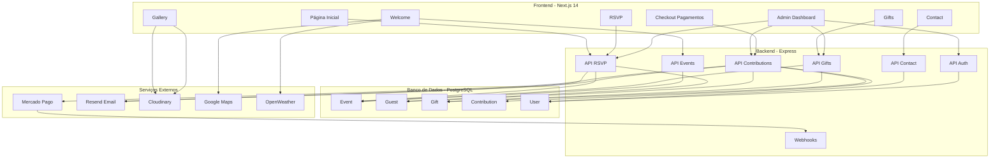

# Relatório de Revisão e Integração do Projeto

## 📊 Resumo Executivo

Este documento apresenta uma revisão abrangente do Sistema de Convite de Casamento, identificando todas as opções existentes, gaps de integração e apresentando um plano detalhado para integrar o sistema de forma coesa e modular.

**Data da Revisão:** 06/02/2026
**Status Atual:** Backend funcional, Frontend desconectado
**Objetivo:** Integrar frontend com backend e adicionar funcionalidades faltantes

---

## 🏗️ Estrutura do Projeto

### Arquitetura Atual

```
/root/convite/
├── frontend/              # Next.js 14 (App Router)
│   ├── app/
│   │   ├── page.tsx      # Página inicial ✅
│   │   ├── welcome/      # Boas-vindas ✅
│   │   ├── rsvp/         # Confirmação de presença ✅ (sem integração)
│   │   ├── gifts/        # Lista de presentes ✅ (sem integração)
│   │   ├── gallery/      # Galeria de fotos ✅ (estático)
│   │   └── contact/      # Contato ✅ (sem integração)
│   ├── components/       # ⚠️ Vazio
│   ├── lib/              # ⚠️ Vazio
│   └── types/            # ⚠️ Vazio
│
├── backend/              # Express + TypeScript
│   ├── src/
│   │   ├── index.ts      # Entry point ✅
│   │   ├── routes/       # ✅ 4 rotas implementadas
│   │   │   ├── rsvp.ts
│   │   │   ├── gifts.ts
│   │   │   ├── contact.ts
│   │   │   └── contributions.ts
│   │   ├── lib/
│   │   │   └── prisma.ts # ✅ Cliente Prisma
│   │   ├── controllers/  # ⚠️ Vazio
│   │   ├── models/       # ⚠️ Vazio
│   │   └── middleware/   # ⚠️ Vazio
│   └── prisma/
│       └── schema.prisma # ✅ Schema completo
│
├── database/            # Configurações do banco
│   └── config/
│       └── schema.prisma # ✅ Schema Prisma
│
├── docs/                # Documentação
│   ├── api/             # ✅ Documentação da API
│   ├── design/          # ✅ Design System
│   └── requirements/    # ✅ Requisitos
│
└── plans/               # Planos do projeto
    ├── plano-detalhado.md
    └── plano-integracao.md
```

---

## 📋 Inventário de Opções Existentes

### Backend - API Routes (4 rotas implementadas)

| Endpoint | Método | Status | Funcionalidade |
|----------|--------|--------|----------------|
| `/api/rsvp` | GET | ✅ | Listar convidados |
| `/api/rsvp` | POST | ✅ | Criar convidado |
| `/api/rsvp/:id` | GET | ✅ | Buscar convidado |
| `/api/rsvp/:id` | PUT | ✅ | Atualizar convidado |
| `/api/rsvp/:id` | DELETE | ✅ | Deletar convidado |
| `/api/rsvp/qr/:token` | GET | ✅ | Validar QR Code |
| `/api/gifts` | GET | ✅ | Listar presentes |
| `/api/gifts` | POST | ✅ | Criar presente |
| `/api/gifts/:id` | GET | ✅ | Buscar presente |
| `/api/gifts/:id` | PUT | ✅ | Atualizar presente |
| `/api/gifts/:id` | DELETE | ✅ | Deletar presente |
| `/api/gifts/:id/reserve` | POST | ✅ | Reservar presente (legado) |
| `/api/contact` | GET | ⚠️ | Listar mensagens (stub) |
| `/api/contact` | POST | ⚠️ | Enviar mensagem (stub) |
| `/api/contributions` | GET | ✅ | Listar contribuições |
| `/api/contributions` | POST | ✅ | Criar contribuição |
| `/api/contributions/:id` | GET | ✅ | Buscar contribuição |
| `/api/contributions/webhook` | POST | ✅ | Webhook pagamento |

**Total:** 18 endpoints implementados (15 funcionais, 3 stubs)

### Frontend - Páginas (6 páginas implementadas)

| Página | Rota | Status Backend | Funcionalidade |
|--------|------|----------------|----------------|
| Home | `/` | ❌ Não integrado | Navegação básica |
| Welcome | `/welcome` | ❌ Não integrado | Informações estáticas |
| RSVP | `/rsvp` | ❌ Não integrado | Formulário sem envio |
| Gifts | `/gifts` | ❌ Não integrado | Dados mockados |
| Gallery | `/gallery` | ❌ Não integrado | Galeria estática |
| Contact | `/contact` | ❌ Não integrado | Formulário sem envio |

**Total:** 6 páginas implementadas (0 integradas com backend)

### Banco de Dados - Schema Prisma (6 modelos)

| Modelo | Campos | Relações | Status |
|--------|--------|----------|--------|
| Event | 10 | gifts, guests | ✅ Definido |
| Guest | 12 | event, contributions | ✅ Definido |
| Gift | 8 | event, contributions | ✅ Definido |
| Contribution | 14 | gift, guest | ✅ Definido |
| RSVP | 8 | - | ⚠️ Legado |
| Contact | 6 | - | ⚠️ Legado |

**Total:** 6 modelos (4 ativos, 2 legados)

---

## ⚠️ Gaps Identificados

### 1. Frontend Desconectado do Backend

**Problema:** Nenhuma página do frontend faz chamadas reais para a API do backend.

**Impacto:** Alto - O sistema não funciona como um todo, apenas partes isoladas.

**Evidências:**
- [`frontend/app/rsvp/page.tsx`](frontend/app/rsvp/page.tsx:15-19) - Apenas `console.log` e `alert()`
- [`frontend/app/gifts/page.tsx`](frontend/app/gifts/page.tsx:2-11) - Dados mockados em array
- [`frontend/app/contact/page.tsx`](frontend/app/contact/page.tsx:13-17) - Apenas `console.log` e `alert()`

**Solução:** Implementar cliente HTTP e integrar todas as páginas.

### 2. Falta de Componentes Reutilizáveis

**Problema:** Diretórios `components/`, `lib/` e `types/` estão vazios.

**Impacto:** Médio - Código duplicado, difícil manutenção.

**Solução:** Criar estrutura de componentes reutilizáveis.

### 3. Ausência de Bibliotecas Essenciais

**Problema:** Bibliotecas importantes não instaladas.

**Impacto:** Alto - Funcionalidades críticas não implementadas.

**Bibliotecas Faltantes:**
- React Hook Form (formulários)
- Zod (validação)
- Framer Motion (animações)
- MercadoPago.js (pagamentos)
- NextAuth.js (autenticação)
- Resend (emails)
- Cloudinary (upload de imagens)

### 4. Backend Incompleto

**Problema:** Diretórios `controllers/`, `models/` e `middleware/` estão vazios.

**Impacto:** Médio - Código misturado nas rotas, difícil escalabilidade.

**Solução:** Refatorar para separar responsabilidades.

### 5. Integrações Externas Não Implementadas

**Problema:** Serviços externos configurados mas não integrados.

**Impacto:** Crítico - Sistema de pagamentos não funciona.

**Serviços Pendentes:**
- Mercado Pago (PIX e cartão)
- Resend (envio de emails)
- Cloudinary (upload de imagens)
- Google Maps (localização)
- OpenWeather (previsão do tempo)

### 6. Dashboard Administrativo Ausente

**Problema:** Não há área administrativa para gerenciar o sistema.

**Impacto:** Alto - Difícil gerenciar convidados, presentes e pagamentos.

**Solução:** Criar dashboard com NextAuth.js.

### 7. Validação de Dados Insuficiente

**Problema:** Validação básica no frontend, nenhuma no backend.

**Impacto:** Médio - Dados inconsistentes podem entrar no sistema.

**Solução:** Implementar Zod para validação rigorosa.

### 8. Segurança de Dados

**Problema:** Dados sensíveis (CPF, PIX key) não criptografados.

**Impacto:** Crítico - Violação de LGPD.

**Solução:** Implementar criptografia AES-256.

---

## 🎯 Plano de Integração

### Fase 1: Fundação (Infraestrutura)

**Objetivo:** Configurar base sólida para integração.

**Tarefas:**
1. Instalar bibliotecas necessárias no frontend
2. Instalar bibliotecas necessárias no backend
3. Criar tipos TypeScript compartilhados
4. Criar cliente HTTP para chamadas de API

**Arquivos a Criar:**
- `frontend/types/index.ts` - Tipos compartilhados
- `frontend/lib/api.ts` - Cliente HTTP
- `frontend/lib/utils.ts` - Utilitários

### Fase 2: Integração Frontend-Backend

**Objetivo:** Conectar frontend com backend.

**Tarefas:**
1. Atualizar página RSVP para usar API
2. Atualizar página Gifts para buscar dados da API
3. Atualizar página Contact para enviar mensagens
4. Implementar sistema de contribuições/pagamentos

**Arquivos a Modificar:**
- `frontend/app/rsvp/page.tsx`
- `frontend/app/gifts/page.tsx`
- `frontend/app/contact/page.tsx`

### Fase 3: Componentes Reutilizáveis

**Objetivo:** Criar biblioteca de componentes.

**Tarefas:**
1. Criar componentes UI básicos (Button, Input, Card)
2. Criar componentes de layout (Navbar, Footer)
3. Criar componentes de formulários
4. Criar componentes de presentes

**Arquivos a Criar:**
- `frontend/components/ui/button.tsx`
- `frontend/components/ui/input.tsx`
- `frontend/components/ui/card.tsx`
- `frontend/components/layout/navbar.tsx`
- `frontend/components/layout/footer.tsx`

### Fase 4: Integração de Serviços Externos

**Objetivo:** Conectar com serviços de terceiros.

**Tarefas:**
1. Implementar integração com Mercado Pago
2. Implementar envio de emails com Resend
3. Implementar upload de imagens com Cloudinary
4. Adicionar integração com Google Maps
5. Adicionar integração com OpenWeather

**Arquivos a Criar:**
- `backend/src/services/mercadopago.ts`
- `backend/src/services/email.ts`
- `backend/src/services/cloudinary.ts`

### Fase 5: Autenticação e Dashboard

**Objetivo:** Criar área administrativa.

**Tarefas:**
1. Implementar NextAuth.js
2. Criar middleware de autenticação
3. Criar dashboard administrativo
4. Implementar CRUD de convidados
5. Implementar CRUD de presentes

**Arquivos a Criar:**
- `backend/src/auth.ts`
- `backend/src/middleware/auth.ts`
- `frontend/app/admin/page.tsx`
- `frontend/app/admin/guests/page.tsx`
- `frontend/app/admin/gifts/page.tsx`

### Fase 6: Melhorias de UX

**Objetivo:** Melhorar experiência do usuário.

**Tarefas:**
1. Adicionar animações com Framer Motion
2. Implementar validação de formulários com Zod
3. Adicionar loading states
4. Criar sistema de countdown
5. Implementar QR Codes para convidados

**Arquivos a Criar:**
- `frontend/components/shared/countdown.tsx`
- `frontend/components/shared/qr-code.tsx`
- `frontend/components/shared/loading-spinner.tsx`

### Fase 7: Segurança e LGPD

**Objetivo:** Garantir conformidade com LGPD.

**Tarefas:**
1. Criptografar dados sensíveis
2. Implementar rate limiting
3. Adicionar proteção CSRF
4. Criar política de privacidade
5. Implementar direito ao esquecimento

**Arquivos a Modificar:**
- `backend/src/routes/contributions.ts`
- `backend/src/routes/rsvp.ts`

### Fase 8: Testes e Deploy

**Objetivo:** Validar e publicar o sistema.

**Tarefas:**
1. Testar integrações end-to-end
2. Validar conformidade com LGPD
3. Configurar ambiente de produção
4. Deploy frontend (Vercel)
5. Deploy backend (Railway)

---

## 📊 Diagrama de Arquitetura Integrada



---

## 🚀 Checklist de Implementação

### Backend (15 itens)
- [ ] Configurar Mercado Pago SDK
- [ ] Configurar Resend SDK
- [ ] Configurar Cloudinary SDK
- [ ] Criar rotas de autenticação
- [ ] Implementar middleware de autenticação
- [ ] Criar rotas de eventos
- [ ] Implementar webhooks do Mercado Pago
- [ ] Adicionar validação de CPF
- [ ] Criptografar dados sensíveis
- [ ] Implementar rate limiting
- [ ] Refatorar controllers
- [ ] Refatorar models
- [ ] Adicionar modelos User
- [ ] Executar migrations
- [ ] Criar seeds iniciais

### Frontend (20 itens)
- [ ] Instalar e configurar bibliotecas
- [ ] Criar cliente HTTP
- [ ] Criar tipos TypeScript
- [ ] Atualizar página RSVP
- [ ] Atualizar página Gifts
- [ ] Atualizar página Contact
- [ ] Criar componentes UI básicos
- [ ] Criar componentes de layout
- [ ] Criar componentes de formulários
- [ ] Implementar sistema de pagamentos
- [ ] Criar dashboard administrativo
- [ ] Adicionar animações
- [ ] Implementar validação Zod
- [ ] Adicionar loading states
- [ ] Criar sistema de countdown
- [ ] Implementar QR Codes
- [ ] Integrar Google Maps
- [ ] Integrar OpenWeather
- [ ] Implementar exportação de dados
- [ ] Adicionar política de privacidade

### Integrações Externas (5 itens)
- [ ] Configurar Mercado Pago (sandbox)
- [ ] Configurar Resend
- [ ] Configurar Cloudinary
- [ ] Configurar Google Maps API
- [ ] Configurar OpenWeather API

### Testes e Deploy (4 itens)
- [ ] Testar integrações end-to-end
- [ ] Validar conformidade com LGPD
- [ ] Deploy frontend (Vercel)
- [ ] Deploy backend (Railway)

**Total:** 44 itens para implementação

---

## 📝 Riscos e Mitigações

| Risco | Impacto | Probabilidade | Mitigação |
|-------|---------|--------------|-----------|
| Integração Mercado Pago falhar | Alto | Médio | Testar em sandbox antes de produção |
| Timeout de API | Médio | Baixo | Implementar retry e timeout |
| Dados inconsistentes | Alto | Baixo | Validação rigorosa e transações |
| Problemas de performance | Médio | Médio | Otimizar queries e usar cache |
| Segurança de dados | Crítico | Baixo | Criptografia e LGPD compliance |
| Falta de tempo para implementação | Alto | Médio | Priorizar funcionalidades críticas |

---

## 🎓 Recomendações

### Prioridades Alta (Crítico)
1. Integrar frontend com backend
2. Implementar sistema de pagamentos (Mercado Pago)
3. Criptografar dados sensíveis (LGPD)
4. Criar dashboard administrativo

### Prioridades Média (Importante)
5. Implementar autenticação
6. Criar componentes reutilizáveis
7. Adicionar validação de formulários
8. Implementar envio de emails

### Prioridades Baixa (Desejável)
9. Adicionar animações
10. Integrar Google Maps
11. Integrar OpenWeather
12. Implementar exportação de dados

---

## 📚 Documentação de Referência

- [Plano Detalhado](./plano-detalhado.md) - Especificação completa do sistema
- [Plano de Integração](./plano-integracao.md) - Detalhes técnicos da integração
- [Documentação da API](../docs/api/README.md) - Endpoints da API
- [Design System](../docs/design/README.md) - Cores, tipografia e componentes
- [Requisitos](../docs/requirements/README.md) - Requisitos funcionais e não-funcionais

---

## ✅ Conclusão

O projeto possui uma base sólida com backend funcional e schema de banco de dados bem estruturado. No entanto, o frontend está completamente desconectado do backend, tornando o sistema não funcional como um todo.

A integração completa requer 44 itens de implementação distribuídos em 8 fases, com prioridades claras para garantir que as funcionalidades críticas (pagamentos, LGPD, dashboard) sejam implementadas primeiro.

Recomenda-se iniciar pela Fase 1 (Fundação) para garantir uma base sólida antes de avançar para as integrações mais complexas.

---

**Próximos Passos:**
1. Aprovar este plano de integração
2. Iniciar implementação da Fase 1
3. Validar cada fase antes de avançar
4. Testar integrações end-to-end
5. Deploy em produção
