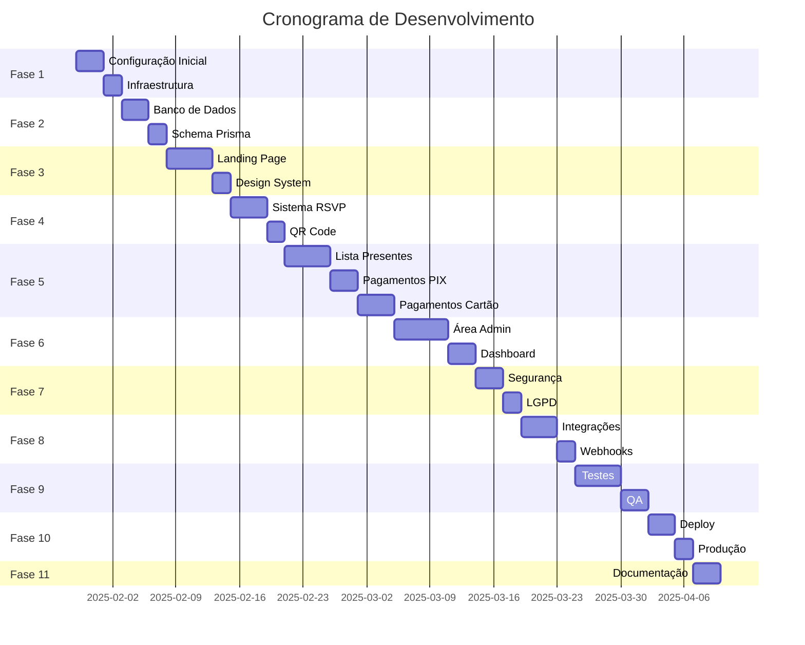

# Resumo Executivo - Sistema de Convite de Casamento

## 📋 Visão Geral

Sistema web completo, robusto e escalável para convite de casamento com processamento real de pagamentos via PIX e cartão de crédito brasileiro. Este sistema será usado em **produção real**, processando valores reais de presentes de casamento.

**Data do Evento:** 22/06/2025

---

## 🎯 Objetivos Principais

1. **Experiência do Usuário (Convidados)**
   - Landing page romântica e interativa
   - Sistema RSVP completo com QR Code de check-in
   - Lista de presentes com pagamentos em tempo real
   - Interface mobile-first (90% do acesso será mobile)

2. **Gestão (Noivos)**
   - Dashboard administrativo completo
   - Gestão de convidados e presentes
   - Relatórios financeiros detalhados
   - Scanner QR Code para check-in no evento

3. **Pagamentos**
   - Integração com Mercado Pago (PIX dinâmico + cartão parcelado)
   - Processamento seguro e compliance com LGPD
   - Webhooks para confirmações instantâneas
   - Fallback para PIX estático em caso de falha

4. **Segurança e Compliance**
   - Criptografia AES-256 para dados sensíveis
   - Validação rigorosa de CPF (módulo 11)
   - Rate limiting para prevenir abuso
   - Anonimização automática após 90 dias (LGPD)

---

## 🏗️ Arquitetura Técnica

### Stack Tecnológico

| Camada | Tecnologia | Justificativa |
|--------|-----------|---------------|
| **Frontend** | Next.js 14 (App Router) | Framework moderno, SEO-friendly, SSR |
| **Linguagem** | TypeScript 5 | Type safety, melhor DX |
| **Estilização** | Tailwind CSS | Utility-first, customizável |
| **Animações** | Framer Motion | Animações suaves, performáticas |
| **Formulários** | React Hook Form + Zod | Validação robusta |
| **Autenticação** | NextAuth.js | Seguro, flexível |
| **Banco de Dados** | PostgreSQL + Prisma | Relacional, ORM poderoso |
| **Pagamentos** | Mercado Pago SDK | Gateway brasileiro, PIX nativo |
| **Email** | Resend.com | Transacional, confiável |
| **Storage** | Cloudinary | Upload de imagens, otimização |
| **Deploy** | Vercel Pro | Edge Network, Analytics |

### Design System

- **Cores:** Dourado (#D4AF37), Rosê (#C9A9A6), Off-white (#FAF9F6), Grafite (#2C2C2C)
- **Fontes:** Playfair Display (títulos), Inter (corpo)
- **Estilo:** Romântico, elegante, mobile-first
- **Animações:** Fade-in on scroll, parallax suave, partículas/pétalas

---

## 📊 Funcionalidades Principais

### Página Pública (Convidados)

✅ **Landing Page**
- Hero com contador regressivo (22/06/2025)
- Seção "Nossa História" com timeline animada
- Galeria responsiva lazy-loaded com Lightbox
- Player de música de fundo discreto
- Google Maps embed para localização
- Previsão do tempo (OpenWeather API)
- Animações suaves (Framer Motion)

✅ **Sistema RSVP**
- Formulário completo (nome, email, telefone, acompanhantes)
- Preferências alimentares (vegetarian, vegan, celíaco, alergias)
- Sugestão de música (Spotify ou texto livre)
- Geração de QR Code único por confirmação
- Email automático de confirmação com QR Code anexo

✅ **Lista de Presentes**
- Grid responsivo com fotos, títulos, descrições
- Sistema de cotas (contribuição total ou parcial, mínimo R$ 50,00)
- Carrinho de compras com persistência localStorage
- Progresso visual de arrecadação
- Opção de presente anônimo

✅ **Pagamentos**
- **PIX Dinâmico:** QR Code + Copia e Cola, expiração 30min
- **Cartão Parcelado:** 1x a 12x (até 6x sem juros)
- **3DS 2.0:** Obrigatório para compras > R$ 200
- **Validação CPF:** Algoritmo módulo 11
- **Rate Limiting:** 5 tentativas por IP a cada 10 minutos
- **Webhooks:** Confirmações instantâneas
- **Fallback:** PIX estático em caso de falha do gateway

### Área Administrativa (Noivos)

✅ **Dashboard**
- Total arrecadado (líquido e bruto)
- Gráfico de PIX vs Cartão vs Boleto
- Taxa de conversão (visualizações vs compras)
- Lista de presentes mais populares

✅ **Gestão de Convidados**
- Tabela com filtros (confirmados, pendentes, restrições)
- Exportação Excel/CSV
- Scanner QR Code via câmera para check-in

✅ **Gestão de Presentes**
- CRUD completo (adicionar, editar, status)
- Marcar como "entregue" ou "esgotado"
- Ocultar itens sem deletar

✅ **Gerenciamento Financeiro**
- Configurar chave PIX criptografada
- Visualizar transações pendentes/expiradas
- Estorno manual via API gateway

✅ **Notificações**
- Web Push ou Telegram Bot para novas compras
- Log de atividades completo

---

## 🔐 Segurança e LGPD

### Medidas de Segurança

- ✅ HTTPS forçado (HSTS)
- ✅ Criptografia AES-256 para CPF e chave PIX
- ✅ Rate limiting (5 tentativas/10min por IP)
- ✅ Validação de inputs com Zod
- ✅ Proteção CSRF
- ✅ Sanitização XSS
- ✅ Validação de assinatura de webhook
- ✅ Soft descriptor: "PRESENTE CASAMENTO"

### Compliance LGPD

- ✅ Checkbox explícito de consentimento
- ✅ Criptografia de dados sensíveis
- ✅ Anonimização automática (90 dias após evento)
- ✅ Política de privacidade
- ✅ Termos de uso
- ✅ Direito ao esquecimento
- ✅ Log de acesso a dados

---

## 📦 Entregáveis

### Código

- ✅ Repositório GitHub privado
- ✅ Código completo e documentado
- ✅ Scripts de migration Prisma
- ✅ Collection Insomnia/Postman para testar APIs

### Deploy

- ✅ Deploy em Vercel Pro
- ✅ Domínio personalizado configurado
- ✅ Variáveis de ambiente setadas
- ✅ Analytics e Speed Insights ativos
- ✅ PostgreSQL provisionado (Neon ou Supabase)
- ✅ Backup automático daily
- ✅ Connection pooling (PgBouncer) ativo

### Integrações

- ✅ Mercado Pago configurado (produção)
- ✅ Webhooks do Mercado Pago apontados
- ✅ Resend.com (domain verified)
- ✅ Cloudinary (upload preset configurado)

### Documentação

- ✅ README completo (setup local, env vars, deploy)
- ✅ "Como usar o painel admin" (para os noivos)
- ✅ "Como trocar fotos e textos"
- ✅ "Taxas dos gateways" (transparência)
- ✅ "Checklist dia do evento" (check-in com QR Code)

---

## 🧪 Testes e QA

### Checklist de Testes

- [ ] Fluxo PIX completo em sandbox (pagar e receber webhook)
- [ ] Cartão de teste recusado (validar erro amigável)
- [ ] Teste de carga: 50 requisições simultâneas
- [ ] Validação CPF (testar CPF inválido é bloqueado)
- [ ] Teste mobile (iPhone SE, iPhone 14, Android médio)
- [ ] Teste de expiração de PIX (esperar ou forçar status cancelled)
- [ ] Todas as validações de formulário
- [ ] Responsividade em diferentes tamanhos de tela
- [ ] Acessibilidade (WCAG 2.1)
- [ ] Testes de segurança (OWASP Top 10)

---

## 💰 Custos Estimados

### Serviços Externos (Mensal)

| Serviço | Plano | Custo Estimado |
|----------|--------|----------------|
| Vercel Pro | Pro | $20.00 |
| PostgreSQL (Neon) | Serverless | $0.00 - $25.00 |
| Mercado Pago | Por transação | 1.99% + R$ 0,50 |
| Resend.com | Free/Pro | $0.00 - $20.00 |
| Cloudinary | Free/Pro | $0.00 - $89.00 |
| **Total Mensal** | | **$20.00 - $154.00** |

### Custos de Transação (Mercado Pago)

| Método | Taxa |
|--------|-------|
| PIX | 0.99% |
| Cartão de Crédito | 3.99% + R$ 0,50 |
| Boleto | 2.99% + R$ 2,00 |

---

## 📅 Cronograma Estimado

### Fases de Desenvolvimento

**Tempo Total Estimado:** ~60 dias (2 meses)

---

## 🎯 MVP Mínimo (Priorização)

Se necessário priorizar, manter nesta ordem:

1. ✅ Landing page estática bonita
2. ✅ RSVP com email confirmação
3. ✅ Lista de presentes visual
4. ✅ Pagamento PIX (obrigatório para Brasil)
5. ✅ Área admin básica (ver presentes e confirmados)
6. ⏳ Cartão parcelado (fase 2 se necessário)
7. ⏳ Sistema de cotas parciais (fase 2 se necessário)

---

## ❓ Perguntas Importantes

### 1. Gateway de Pagamento

**Pergunta:** Qual gateway de pagamento você prefere?

**Opções:**
- **A) Mercado Pago** (Recomendado) - PIX dinâmico, parcelamento nativo, amplamente usado no Brasil
- **B) Efí Pay** (Gerencianet) - Especialista em PIX, API cartão robusta
- **C) Asaas** - Moderno, PIX + cartão parcelado + webhooks robustos

**Recomendação:** Mercado Pago (Opção A) - Mais popular, melhor documentação, suporte nativo para PIX e parcelamento.

---

### 2. Data Limite

**Pergunta:** Qual é a data limite para entrega do sistema?

**Contexto:** O evento está marcado para 22/06/2025. Precisamos saber quanto tempo temos para desenvolvimento.

**Sugestão:** Mínimo 60 dias antes do evento para testes e ajustes.

---

### 3. Orçamento

**Pergunta:** Qual é o orçamento disponível para serviços externos?

**Estimativa Mensal:** $20.00 - $154.00 (dependendo do plano de cada serviço)

**Custos de Transação:** 0.99% (PIX) a 3.99% + R$ 0,50 (cartão)

---

### 4. Funcionalidades Prioritárias

**Pergunta:** Quais funcionalidades são absolutamente essenciais para o MVP?

**Opções:**
- A) Landing page + RSVP + Lista presentes visual + Pagamento PIX
- B) Todas as funcionalidades descritas no plano completo
- C) Algumas funcionalidades específicas (quais?)

---

### 5. Acesso Administrativo

**Pergunta:** Quantos usuários administrativos serão necessários?

**Opções:**
- A) 1 usuário (apenas os noivos)
- B) 2-3 usuários (noivos + 1 ajudante)
- C) Mais de 3 usuários

---

### 6. Check-in no Evento

**Pergunta:** Como será feito o check-in no evento?

**Opções:**
- A) Scanner QR Code via câmera (recomendado)
- B) Lista manual de convidados
- C) Ambos (QR Code + lista manual)

---

### 7. Notificações

**Pergunta:** Como vocês gostariam de receber notificações de novas compras?

**Opções:**
- A) Web Push (notificações no navegador)
- B) Telegram Bot (mensagens no Telegram)
- C) Email (notificações por email)
- D) Todas as opções acima

---

### 8. Backup e Monitoramento

**Pergunta:** Qual nível de monitoramento e backup vocês precisam?

**Opções:**
- A) Básico (backup daily, uptime monitoring)
- B) Intermediário (backup daily + hourly, alertas de erro)
- C) Avançado (backup real-time, monitoramento detalhado, SLA garantido)

---

### 9. Personalização

**Pergunta:** Quanto conteúdo será personalizado pelos noivos?

**Opções:**
- A) Apenas textos e fotos
- B) Textos, fotos, cores e fontes
- C) Textos, fotos, cores, fontes e layout

---

### 10. Suporte Pós-Lançamento

**Pergunta:** Vocês precisarão de suporte técnico após o lançamento?

**Opções:**
- A) Não, conseguimos gerenciar sozinhos
- B) Sim, suporte básico (responder dúvidas)
- C) Sim, suporte completo (manutenção, atualizações, correções)

---

## 📞 Próximos Passos

1. **Responder às perguntas acima** para alinhar expectativas
2. **Revisar o plano detalhado** e fazer ajustes se necessário
3. **Aprovar o cronograma** e prioridades
4. **Iniciar desenvolvimento** na Fase 1 (Configuração Inicial)
5. **Reuniões semanais** para acompanhar progresso

---

## 📚 Documentação Disponível

1. **[Plano Detalhado](./plano-detalhado.md)** - Arquitetura, fluxos, design system, cronograma
2. **[Estrutura de Arquivos](./estrutura-arquivos.md)** - Estrutura completa do projeto
3. **[Exemplos de Código](./exemplos-codigo.md)** - Exemplos de código para componentes principais

---

**Última Atualização:** 29/01/2025
**Versão:** 1.0.0
**Status:** Aguardando aprovação e respostas às perguntas
